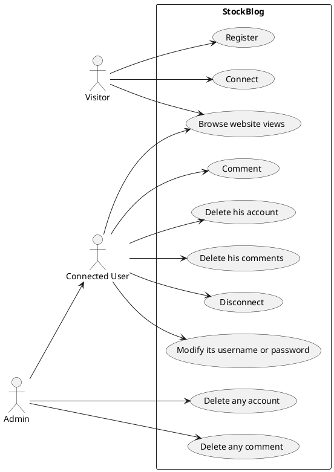
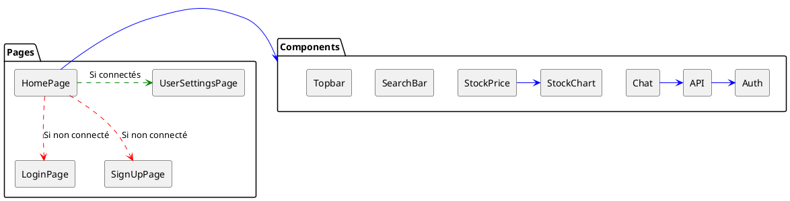
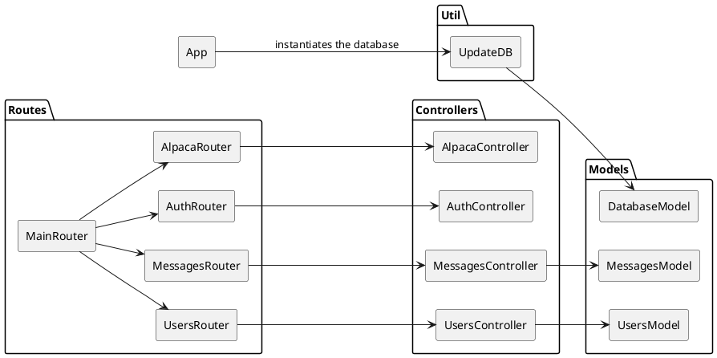

---
title: StockBlog 
author:  
- MIGNE Matthieu
- SORIA-RAMOS Gabriel
- EL AHMAR Anas
--- 

**Notre site: [StockBlog](https://stock-blog.netlify.app/)**

**[Vidéo de démonstration](https://drive.google.com/file/d/1_p1LjgRqOQt4vxgPxObOdHXLxyPRJcG-/view?usp=sharing)**

## Cahier des charges

Nous souhaitons créer un site affichant les courbes de différents actifs bousiers et qui donne la possibilité aux utilisateurs d'interagir à leur sujet en commentant, ou en pariant sur une montée ou une descente de la valeur de l'actif à la prochaine unité de temps. Seul les utilisateurs connectés peuvent commenter. 

Le site comportera 2 vues principales: 
- la page d'accueil qui a une boîte de sélection pour choisir le graphique à afficher avec les commentaires associés et donne la possibilité d'accéder aux paramètres de son compte
- la page de ses paramètres de compte pou changer son nom d'utilisateur, son mot de passe, voir l'historique de ses messages, supprimer ses messages ou son compte.

### Cas d'usage



### Captures d'écran


### API mise en place

Donner le lien vers la documentation swagger et/ou faire un tableau récapitulant l'API

[Swagger doc](https://stock-blog-backend.osc-fr1.scalingo.io/doc/)

## Architecture du code

### FrontEnd



#### Les choix
Nous avons choisi de faire de la HomePage un point central de l'application, effctivement c'est elle qui s'assure que tous les composants se base sur la même liste de symboles et le même symbole actuellement sélectionné.

Tous nos appels API sont faits grâce au module API dans le package Components, la disctinction entre les appels qui correspondent à ceux de l'API interne et à ceux de l'API externe sont entièrement gérés par le backend.

Auth se charge de gérer les token et informations de session dans le stockage local.

Pour le Chat nous voulions un chat interactif en direct, nous avons donc choisi de faire des appels toute les secondes pour le mettre à jour. nous avons asscoié un chat pour chaque symbole.

### Backend

#### Schéma de votre base de donnée

```plantuml
class users{
  name
  email
  passhash
  role
}

class messages {
  id
  symbol
  content
  userMail
  createdAt
  updatedAt
}

users "1" --> "n" messages : posts
```

#### Architecture de votre code



La base de données est créée et initialisée avec l'adiministarteur initial à partir de app à l'instanciation du serveur. Lors d'un appel d'une méthode du backend, le routeur dirige vers le controlleur correspondant qui va ensuite traiter la requête et retourner la réponse. Alpaca est le contrôleur en charge de l'API externe qui nous fournit les données des courbes et les symboles. Pour le ssymboles nous avons décider d'en sélectionner 10 à afficher bien qu'il aurait été possible de faire beacoup plus, mais nous avons fait ce choix afin que chque chat soit plus centralisé du fait de notre nombre d'utilisateurs très réduit.

### Gestion des rôles et droits

Expliquer ici les différents rôles mis en place, et comment ils sont gérés dans votre code.

Il y a 3 rôles: visiteur, utilisateur connecté, et administrateur.

- Coté backend

Le rôle est vérifié à l'aide du token transmis par le client, ensuite nous utilisons une fonction middleware pour vérifier si le token est bien un token utilisateur ou si le token est bien un token administrateur. Certaines fonctionnalités ne sont accessbles que par l'utilisateur concerné ou l'administrateur, dans ces cas-là on va vérifier si l'utilisateur est administrateur, et si non on va vérifier que l'email stocké dans le payload du token transmis par le client correspond bien à l'email de l'utilisateur concerné.

- Coté frontend

Le rôle est stocké en local afin de savoir quelle vue afficher. Il est donc facilement possible d'avoir accès aux vues administrateur pour un utilisateur non autorisé, cependant cela n'est pas problématique, car pour toute action le token est vérifié côté backend donc si un utilisateur non autorisé effectue des appels côté backend pour des fonctionnalités administrateur, il sera interdit en backend.

## Test

### Backend

Jest

Décrivez les tests faits au niveau du backend, leur couverture.

### Frontend

Cypress

Décrivez les tests faits au niveau du frontend, leur couverture.

## Intégration + déploiement (/3)

Nous avons déployé deux dépôts, un sur Scalingo pour le backend et un autre sur Netlify pour le backend.

## Installation

Pour installer l'application il faut effectuer dans le terminal à la racine du projet:
```bash
npm install
```
Un script installera les dépendances pour le backend et le frontend automatiquement.

Ensuite pour lancer l'application en mode développeur il faut exécuter:

```bash
npm run dev
```

Ou en mode production:

```bash
npm run start
```
